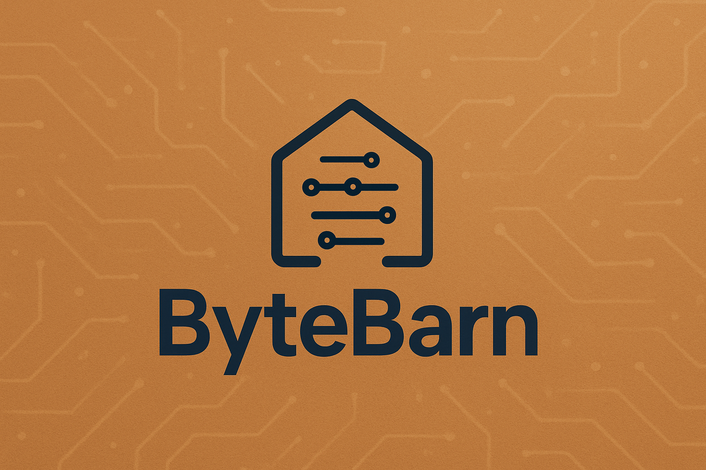

# ByteBarn

Empowering Kenyan FinTech companies and banks with robust, developer-friendly SDKs and tools.

## Overview

ByteBarn builds **powerful Software Development Kits (SDKs)** tailored for financial institutions and FinTech innovators in Kenya. Our SDKs simplify integration with banking and payment APIs—enabling faster, safer, and more reliable financial services.

We specialize in **Rust** and **Python** because they offer:
- **High-performance, memory-safe desktop applications** (Rust) — native GUIs, fast cross-platform binaries, and performance-sensitive client logic.
- **Rapid server-side development and integrations** (Python) — backend services, web frameworks, and scripting for quick iteration and ops automation.
- **Cross-platform compatibility** — SDKs and tools designed to work reliably across both desktop and server environments.

## Core Offerings

### SDKs
Production-ready SDKs that wrap Kenyan banking and payment APIs with clean, idiomatic interfaces in:
- **Rust** — targeted for desktop environments: native GUIs, fast cross‑platform binaries, and memory‑safe, high-performance client applications.
- **Python** — targeted for server backend services: web backends, API integrations, scripting, and ops automation.

### Developer Tools
In addition to SDKs, we provide:
- CLI utilities for API testing and sandbox management
- Code generators for auto-creating SDK clients from OpenAPI specs
- Local development simulators for offline FinTech integration testing

## For FinTech Companies & Banks

If your institution exposes APIs and wants to:
- Reduce integration time for third-party developers
- Improve developer experience with well-documented, typed SDKs
- Support both cloud and on-premise integration scenarios

→ **ByteBarn’s SDKs are built for you.**

## Open Source & Collaboration

We believe in transparency and community-driven innovation. Many of our tools are open source, and we welcome contributions from developers across Kenya and beyond.

##  Get in Touch

Have questions? Want to request support for your API?  
Reach out via [email](mailto:john@kagunda.dev) or open an issue in any of our repositories.

---

*Building the future of African FinTech—one SDK at a time.*